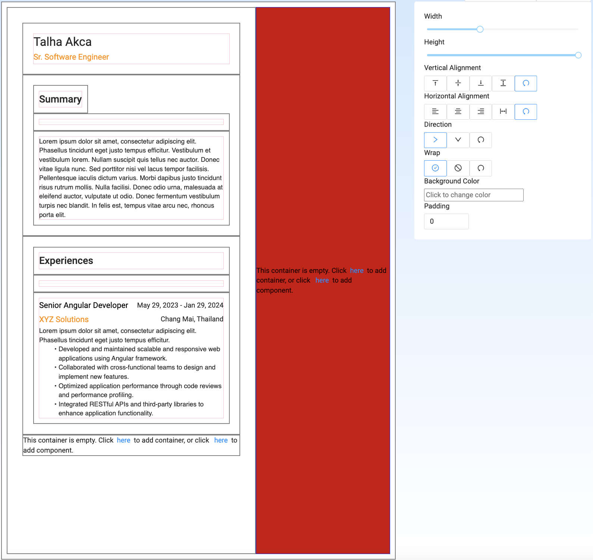
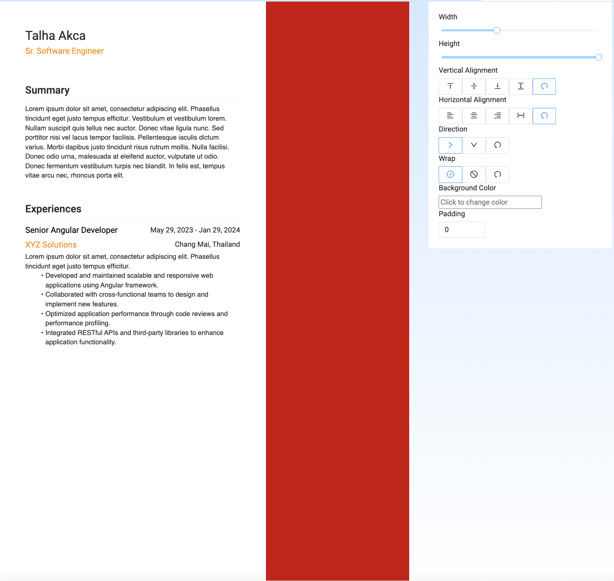

# Resume Builder for Manatal Test Task
  ## My Approach to task
    In my opinion, the challenging part of this task is the allow users to create and/or edit the template. After some time of thinking, I decided to create a module to build a template from scratch. My first approach was to create a content editor and allow users to create their templates along with the components. Here is a breakdown;

    - Users are able to create a template from scratch or edit the existing one 
    - Users are able to create a component from the container and save it for future use 
       - This wasn't succeed because of the time constraint. The architecture allows Users to save a container as component for future use but I didn't implement this further to catch the deadline.
    - Since the industry evolves everyday, our templates should also be able to evolve. Therefore I've supported an architecture which allows users to create infinite numbers of different layouts with using this approach. It can also bind with AI tools such as GPT-4 because its holds the template informations as data and like I've said it can be configured however user like - in this case AI -

    With this thoughts in my mind, I've started the build the content editor.

  ## Aproach To Content Editor
    Since I decided to support the infinite numbers of layout, I've need to create components dynamically. To do so I've decided to use ComponentFactory.I was rendering the div's (Called them container on the UI) in the HTML's, and creating the components dynamically in .ts file of the component using ComponentFactory. I needed the hold the container data as tree but for performance concerns, I've hold the data as flat and use the id field to map the parent to children. And for to be able pass the data to component I've created a config file called input definitions, which holds the component's input definitions for further use (e.g. Changing the candidates name, adding an experience ). This was the most time consuming module in the app. Since a user can add any layout they want, it was hard to maintain intuitivity. For example, where should be the add button? How I'll handle the paddings in edit mode? How can user see the final result? Some good some bad, I've implement the module successfuly ( with of course some bugs, just like every other successful implementation :) )
   \
  As you can see the above screen shot, you can add, delete both component and container inside whichever container you want and change the alignments of them with flex properties such as direction, align items etc. Also you're able to change the document's content. By clicking the ctrl button you're able to close the editing mode and able to see the final result; \
 \
  Content Editor's every primitive components such as text, divider, heading, text, icon, is accepts the html, in other saying you can do anything with HTML. And the whole content editor is also ready to support HTML and CSS.
  The other components designed to ease the UX such as Header Section and Experience section isn't supports HTML inputs but like I've said in the very beginning of this doc, the architecture is also supports the container to component which means that you can create anything using this editor ( You can simply create a landing page) and save them as Components and those components will also support the HTML.

  ## Completed subtasks
   - Create Template From Scratch
   - Create resumes with predefined templates
   - Change CSS attributes (Partially completed)
   - Download as PDF
   - Add Watermark

  ## Missing tasks to achieve every User Story
  - Missing Components
     - Education Section (Implemented but not added to the content editor)
     - Skills Section
  - Theme Editor
    - Eventhough architecture supports theming, couldn't find time to implement it. You can partially change some attributes, but you can't change the whole theme of the resume.
  - UX improvements
    - To make this module more intuitive, you should be able add a Resume and can add this resume to whichever template you want. for time constraints, this also didn't implemented.
  - Downloaded PDF's name should contain candidate's name.
  - Candidate CRUD
  
  ## Libraries Used
  - NG Zorro (UI Library)
  - pdfjs & html2canvas (to export the html as pdf)
  - ngx-colorpicker ( UI Component, to be able to change the background color and for feature theme editor)
  - uuid (to add unique identifier to content tree definition)

    
